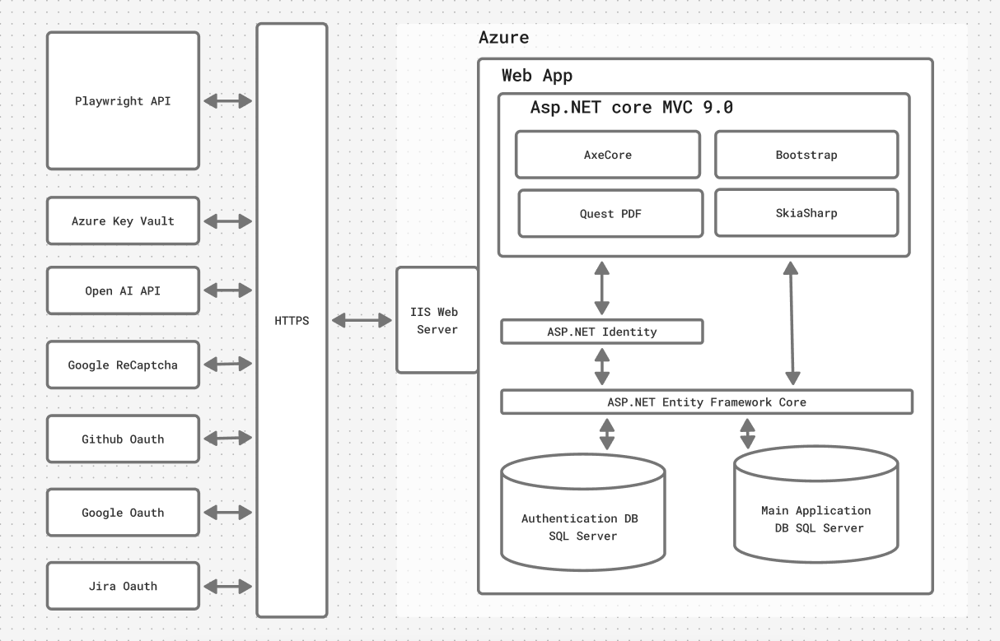

<h1 style="text-align: center; font-size: 48;">
<span></span>
Uxcheckmate</h1>

<p style="text-align: center; font-size: 1.5em;"><i>Your design companion for a better, more accessible web.</i></p>


---

## 🚀 Vision Statement

Our vision is to create an inclusive digital culture where everyone—developers, business owners, and designers—can contribute to making websites accessible, inclusive, and equitable. We believe accessibility is a right, not a privilege.

---

## 🧩 Features

- **Automated Report Generation:** Over a dozen scans to detect and flag common design issues that impact user experience and accessibility.
- **Downloadable Reports:** Save your findings as PDFs or store them online as a registered user.
- **User Dashboard:** Access all previous reports grouped by domain, and export reported issues to Jira.
- **Admin Tools:** Manage feedback, users, and reports from a dedicated admin dashboard.



---

## 🔧 How to Use

1. Fork the repository
2. Install Playwright   
```npm install playwright --with-deps```
3. Add API keys and connection strings to appsettings.json
```{
  "Logging": {
    "LogLevel": {
      "Default": "Debug",
      "Microsoft": "Information",
      "Microsoft.Hosting.Lifetime": "Information"
    }
  },
  "AllowedHosts": "*",
  "ConnectionStrings": {
    "DBConnection": "xxxxx",
    "AuthDBConnection": "xxxxx"
  },
  "Jira": {
    "ClientId": "xxxxx",
    "ClientSecret": "xxxxx",
    "RedirectUri": "https://xxxxx/JiraAuth/Callback"
  },
  "Captcha": {
    "Enabled": "true",
    "SiteKey": "xxxxxx",
    "SecretKey": "xxxxx"
  },
  "Authentication": {
    "GitHub": {
      "ClientId": "xxxxx",
      "ClientSecret": "xxxxx"
    },
    "Google": {
      "ClientId": "xxxxx",
      "ClientSecret": "xxxxx"
    }
  },
    "ReportLimit": {
    "AnonymousUserLimitEnabled": true
  }
}
```
4. To add more scans to the report, add the method call to the switch statement in ```RunCustomAnalysisAsync()``` located in <a href="Uxcheckmate\Uxcheckmate_Main\Services\Concrete\ReportService.cs"> ReportService.cs</a>

##  About Us

### Deep Blue

Inspired by the legendary supercomputer, Deep Blue, our team embodies the spirit of relentless learning and continuous improvement. Just as Deep Blue revolutionized its field by adapting, analyzing, and pushing boundaries, we strive to tackle challenges with the same innovative mindset. We aim to learn from every experience, evolve through collaboration, and persevere until we achieve our goals. *Every move counts.*

This project will serve as our senior capstone and demonstrate our capabilities in programming, web app development, and design. 


